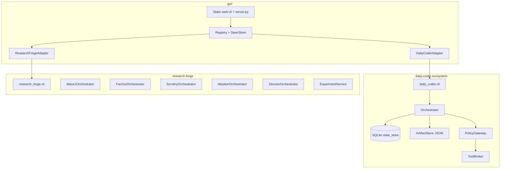

# Architecture overview

This document describes what is **actually wired today** in the `ai_agents` workspace: engineering packages plus the skills-first personal layer.

**Personal / career skills** (on-demand, soft): see [`docs/personal-skills/`](../personal-skills/) and [`docs/orchestration/system-map.md`](../orchestration/system-map.md). They do not add a seventh IDE orchestrator or a personal PolicyGateway.

---

## Topology

| Layer | Source of truth | Entry symbol |
|-------|-----------------|--------------|
| Daily Coder run progress | SQLite via `StateStore` | `Orchestrator.run` in [`daily_coder/orchestrator.py`](../../agents/coding/daily-coder-ecosystem/daily_coder/orchestrator.py) |
| Daily Coder evidence | Immutable artifacts under `runtime_dir/artifacts` | `ArtifactStore` in [`daily_coder/artifacts.py`](../../agents/coding/daily-coder-ecosystem/daily_coder/artifacts.py) |
| Research Forge CLI runs | Wave-specific orchestrators + JSON schemas | [`research_forge/cli.py`](../../agents/research/research-forge/src/research_forge/cli.py) |
| Experiment artifacts | `.research-forge/experiments` under workspace | `ExperimentService` in [`experiments/service.py`](../../agents/research/research-forge/src/research_forge/experiments/service.py) |
| Dashboard steering | `data/threads.jsonl` | `SteerStore` in [`agent_dashboard/steer_store.py`](../gui/agent_dashboard/steer_store.py) |

---

## Daily Coder Ecosystem

**Purpose:** Token-frugal, **artifact-driven** software change orchestration with deterministic enforcement.

### Workflow as data

Phases and role mapping live in [`daily_coder/workflow.py`](../../agents/coding/daily-coder-ecosystem/daily_coder/workflow.py):

- `WORKFLOW_VERSION = "2.1"`
- Profiles `S`, `S_TRIVIAL`, `M`, `L`, `XL` select phase lists (research/brainstorm fan-out differs by size).
- `PHASE_ROLE` binds phases like `PLAN` → `planner`, `RESEARCH` → `researcher`.
- `CONTROL_PHASES` are orchestrator-owned: `INTAKE`, `SIZE`, `READY_TO_BUILD`, `ACCEPTANCE`, `COMPLETE`.

Sizing picks the workflow key via [`daily_coder/router.py`](../../agents/coding/daily-coder-ecosystem/daily_coder/router.py) (`size_request`, `workflow_key`, `phases_for`).

### State machine

Phase legality is enforced in [`daily_coder/state_machine.py`](../../agents/coding/daily-coder-ecosystem/daily_coder/state_machine.py) (`allowed_transition`). Notable edges:

- After `SIZE`, go to `RESEARCH` or skip to `DECIDE`.
- `S_TRIVIAL` allows `IMPLEMENT → TEST_EXECUTE` and `CODE_REVIEW → ALIGNMENT` (skips test author and documenter phases in the workflow list, but keeps alignment for acceptance).

Run **status** (active, waiting on human, waiting on job, complete, simulated, failed) is separate from **phase**; see `RunStatus` and `Phase` in [`daily_coder/models.py`](../../agents/coding/daily-coder-ecosystem/daily_coder/models.py).

### Execution boundary

Models propose tool use; the runtime executes only through:

1. **`PolicyGateway.execute`** — approval, logging, redaction path ([`daily_coder/policy.py`](../../agents/coding/daily-coder-ecosystem/daily_coder/policy.py))
2. **`ToolBroker`** — role allowlists and path rules ([`daily_coder/tool_broker.py`](../../agents/coding/daily-coder-ecosystem/daily_coder/tool_broker.py))

Writes require an approved plan hash when `human_approval.plan_before_writes` is true ([`config/default.json`](../../agents/coding/daily-coder-ecosystem/config/default.json)).

### Context discipline

[`daily_coder/context.py`](../../agents/coding/daily-coder-ecosystem/daily_coder/context.py) builds bounded digests (`research_digest`, `should_stop_research`) so downstream roles do not receive full transcripts.

### Providers

[`daily_coder/providers/`](../../agents/coding/daily-coder-ecosystem/daily_coder/providers/) implements mock (default), OpenAI-compatible, Anthropic, Gemini, command bridge, and registry selection. Live mode is gated by CLI flags and config `require_live_flag`.

### Agent definitions

Prompts and model tiers are **files**, not code:

- [`daily-coder-ecosystem/agents/*/prompt.md`](../../agents/coding/daily-coder-ecosystem/agents/)
- [`agent.json`](../../agents/coding/daily-coder-ecosystem/agents/master/agent.json), [`model.json`](../../agents/coding/daily-coder-ecosystem/agents/master/model.json) per role

JSON outputs validate against [`daily-coder-ecosystem/schemas/`](../../agents/coding/daily-coder-ecosystem/schemas/) via `SchemaRegistry`.

---

## Research Forge

**Purpose:** Structured research pipeline with **mock-by-default** adapters, JSON Schema contracts, decision gates, and optional live mode.

### Wave progression (code modules)

| Wave | Package path | Orchestrator / hub class |
|------|--------------|---------------------------|
| 0 | `wave0/` | Doctor, dry-run, fixture replay |
| 1 | `wave1/` | `Wave1Orchestrator` — sequential DAG: clarify → charter → search → read → extract → verify → compose |
| 2 | `wave2/` | `FanOutOrchestrator` — lanes, scout, curator, saturation |
| 3 | `wave3/` | `ScrutinyOrchestrator` — methods, contradictions, adversarial skeptic, falsification, audit |
| 4 | `wave4/` | `IdeationOrchestrator` — parallel ideators, fabrication check, promotion, lineage graph |
| 5 | `wave5/` | `DirectorOrchestrator` — packet builder, Principal Research Director, challenge path |
| 6 | `wave6/` | Adapters SDK, routing, proposals, maintenance tooling |

CLI wiring: [`research_forge/cli.py`](../../agents/research/research-forge/src/research_forge/cli.py). Config: [`research-forge/config/`](../../agents/research/research-forge/config/). Schemas: [`research-forge/schemas/`](../../agents/research/research-forge/schemas/).

**Persisted Wave 1 runs:** CLI `resume` and `status` reload durable `RunState` from disk (live mode runs the same decision gate as `run --live`). Implementation: [`cli.py`](../../agents/research/research-forge/src/research_forge/cli.py); coverage: [`tests/test_cli.py`](../../agents/research/research-forge/tests/test_cli.py).

### Policy and budget

`PolicyGateway` in [`research_forge/policy/gateway.py`](../../agents/research/research-forge/src/research_forge/policy/gateway.py) registers tool manifests and enforces mock vs live mode. Budgets: [`config/budgets.yaml`](../../agents/research/research-forge/config/budgets.yaml).

### Experiments (separate subsystem)

Human-gated, **token-free** local experiments: Creator → Pre-Reviewer → Runner → Post-Reviewer. Documented in [`research-forge/docs/EXPERIMENTS.md`](../../agents/research/research-forge/docs/EXPERIMENTS.md). Wave 4 `ExperimentArchitect` remains design-only (not auto-run).

---

## GUI (`gui/`)

Thin control plane:

- Loads agents from JSON config ([`agent_dashboard/registry.py`](../gui/agent_dashboard/registry.py))
- Adapters: `daily_coder`, `research_forge` ([`agent_dashboard/adapters/`](../gui/agent_dashboard/adapters/))
- Serves static UI on port **8866** (see root [`README.md`](../README.md))

The dashboard does **not** replace each package’s orchestrator; it proxies health, runs, and steer messages.

---

## Configuration surfaces

| Package | Primary config |
|---------|----------------|
| Daily Coder | [`daily-coder-ecosystem/config/*.json`](../../agents/coding/daily-coder-ecosystem/config/) |
| Research Forge | [`research-forge/config/*.yaml`](../../agents/research/research-forge/config/) |
| GUI (`gui/`) | Package-local JSON (see [`gui/README.md`](../gui/README.md)) |

Environment highlights:

- Research Forge: `RF_PACKAGE_ROOT`, `RF_WORKSPACE`, `RF_RUN_DIR` ([`settings.py`](../../agents/research/research-forge/src/research_forge/settings.py))
- Daily Coder runtime: `.daily-coder/` under target repo (`runtime_dir` in default.json)

---

## What this workspace does *not* include

- **Cursor IDE hooks** (`.cursor/hooks/`) provide **soft** least-privilege assist only — not a substitute for Python gateways (see [Hooks, skills, and enforcement](../ide-agents/hooks-and-skills.md)).
- **No distributed queue production path** for Daily Coder jobs — SQLite + local workers only ([`docs/architecture.md`](../../agents/coding/daily-coder-ecosystem/docs/architecture.md) in package).

---

## Related reading

- [Agent thought processes](../guides/agents-thought-process.md)
- [Research Forge deep dive](../research-forge/research-forge-deep-dive.md)
- [Design lineage](./design-lineage.md)
