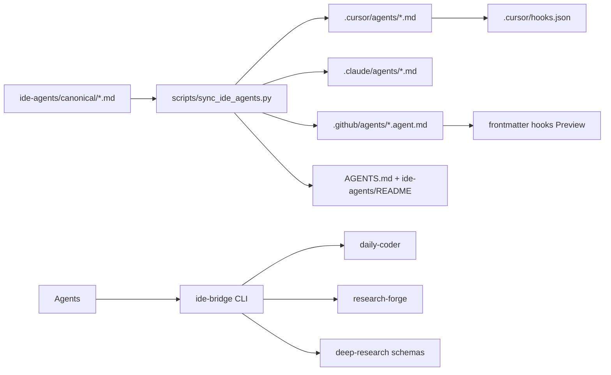

Build a single-source IDE agent pack that projects every orchestration role (deep-research stack, plan-prep, use-master, research-messenger, researcher, and Daily Coder roles) into Cursor, VS Code Copilot, Claude Code, and AGENTS.md-compatible IDEs—preserving the same contracts, tool least-privilege, and hooks—backed by an optional Python ide-bridge for hard enforcement.

# IDE-Portable Full Orchestration Agent Pack

## Verdict / approach (locked)

Ship a **canonical agent library** under [`ide-agents/`](ide-agents/) as the single source of truth, then **project** each agent into every popular IDE path via a sync script. Do **not** rewrite Daily Coder / Research Forge Python enforcement—keep those as the hard runtime. IDE agents get:

1. **Full prompt contracts** (so Cursor/VS Code/Claude can run the workflows natively).
2. **Least-privilege tool frontmatter** per IDE dialect.
3. **Project hooks** (Cursor + VS Code agent-scoped) that block writes for research roles.
4. **Optional `ide-bridge` CLI** so any IDE with shell can run the same orchestration against `daily-coder` / `research-forge` / local deep-research validators when soft prompt-only execution is not enough.

Glean plan-prep for this workspace returned **not configured**; enterprise search is out of scope until Glean setup. Plan is grounded in local repo + Cursor/VS Code docs.

---

## Problem statement

Today:

| Layer | Exists? | IDE-usable? |
|-------|---------|-------------|
| Daily Coder 16 roles + ToolBroker/PolicyGateway | Yes — [`daily-coder-ecosystem/agents/`](daily-coder-ecosystem/agents/) | No (CLI/dashboard only) |
| Research Forge manifests + Wave orchestrators | Yes — [`research-forge/agents/`](research-forge/agents/) | No |
| Cursor skills: deep-research, use-master, research-messenger, plan-prep | Yes — `~/.cursor/skills/` | Cursor skills only; not VS Code `.agent.md` / Claude agents |
| `.cursor/agents/`, `.claude/agents/`, `.github/agents/` | **Missing** | — |
| Cursor/VS Code hooks | **Missing** ([`docs/hooks-and-skills.md`](docs/hooks-and-skills.md)) | — |

Goal: **one separate file per agent**, same ideas/tools/hooks/contracts, invocable from Cursor (`/name`), VS Code Copilot (agent picker + handoffs), Claude Code, and broadly via `AGENTS.md`.

---

## Compatibility matrix (what we target)



| IDE / tool | Projection path | How user invokes |
|------------|-----------------|------------------|
| **Cursor** | [`.cursor/agents/<name>.md`](.cursor/agents/) | `/deep-research`, `/use-master`, Task delegation |
| **VS Code Copilot** | [`.github/agents/<name>.agent.md`](.github/agents/) | Agents dropdown; `handoffs`; `agents:` subagents |
| **Claude Code + VS Code Claude** | [`.claude/agents/<name>.md`](.claude/agents/) | `/agents`, subagent delegation |
| **Codex / Cline / Aider / Gemini / Zed** | Root [`AGENTS.md`](AGENTS.md) + pointers | Project instructions; paste or `@` agent files |
| **Continue** | [`.continue/rules/`](.continue/rules/) thin pointers to canonical | Rules / custom prompts |
| **Windsurf** | [`.windsurfrules`](.windsurfrules) short index | Global rules pointer |

**Shared frontmatter core** (every canonical file): `name`, `description`, `readonly` (or equivalent tools), authority class (`read-only|diagnostic|implementation`), `contract_version`, `skill_refs`, `ide_bridge_command` (optional).

Dialect projections add IDE-specific fields only:

- Cursor: `model`, `readonly`, `is_background`
- Claude: `allowedTools` / `disallowedTools` comma or YAML list
- VS Code: `tools: [...]`, `agents: [...]`, `handoffs: [...]`, optional `hooks:`

---

## Agent inventory (separate file each)

### A. Research orchestration stack (from deep-research + messenger)

| File stem | Authority | Job |
|-----------|-----------|-----|
| `deep-research` | read-only parent orchestrator | Full 8-phase workflow; only component that launches lanes |
| `research-planner` | read-only | Frame brief; 3–8 questions; lane matrix |
| `internal-authority-scout` | read-only | Lane 1 |
| `official-standards-scout` | read-only | Lane 2 |
| `academic-evidence-scout` | read-only | Lane 3 |
| `practitioner-implementation-scout` | read-only | Lane 4 |
| `failure-unfavorable-scout` | read-only | Lane 5 |
| `alternatives-analogy-scout` | read-only | Lane 6 |
| `evidence-integrator` | read-only | `research-draft/1.0` |
| `adversarial-evidence-reviewer` | read-only | PASS / REVISE / INSUFFICIENT_EVIDENCE |
| `targeted-gap-researcher` | read-only | One correction wave |
| `recommendation-scorer` | read-only | Scored packet + recommendation arithmetic |
| `research-messenger` | read-only | ASSEMBLE / ECOSYSTEM / COMBINED; 17 handoffs; no research |

Bodies must **inline or `#file:`-link** the contracts already living at:

- [`~/.cursor/skills/deep-research/references/subagent-contracts.md`](C:\Users\WZ69B7\.cursor\skills\deep-research\references\subagent-contracts.md)
- [`evidence-and-source-rubric.md`](C:\Users\WZ69B7\.cursor\skills\deep-research\references\evidence-and-source-rubric.md)
- [`recommendation-scoring.md`](C:\Users\WZ69B7\.cursor\skills\deep-research\references\recommendation-scoring.md)
- [`ecosystem-compatibility.md`](C:\Users\WZ69B7\.cursor\skills\deep-research\references\ecosystem-compatibility.md)
- [`output-template.md`](C:\Users\WZ69B7\.cursor\skills\deep-research\references\output-template.md)
- schemas: `research-draft-1.0.schema.json`, `research-intelligence-packet-1.0.schema.json`
- Messenger: [`~/.cursor/skills/research-messenger/`](C:\Users\WZ69B7\.cursor\skills\research-messenger\SKILL.md)

**Repo strategy:** copy skill references into [`ide-agents/contracts/`](ide-agents/contracts/) (versioned with the pack) and keep Cursor skills as thin wrappers that point at the same files—or symlink from skills → `ide-agents/contracts/` so SSOT is in-repo. Prefer **in-repo SSOT under `ide-agents/contracts/`** so VS Code/Claude users without `~/.cursor/skills` still work.

### B. Planning prep

| File stem | Authority | Job |
|-----------|-----------|-----|
| `plan-prep` | read-only | Glean-first when available; else local docs/code; emit Planning Context report; never invent stakeholders |

Include degrade path from plan-prep skill (“Limited Research Available”) when Glean MCP is unconfigured (current state).

### C. Coding / Master orchestration

| File stem | Authority | Job |
|-----------|-----------|-----|
| `use-master` | diagnostic→implementation per mission | Launch Master Orchestrator; execute DAG; one unfavorable review; one correction |
| `master-orchestrator` | read-only planner (no edits, no nested agents) | Emit Master plan JSON contract from use-master skill |
| `daily-coder` | implementation parent | Map mission → `daily-coder run/resume/approve` via bridge **or** emulate phase DAG with specialist agents |
| `researcher` | read-only | Port of [`daily-coder-ecosystem/agents/researcher/`](daily-coder-ecosystem/agents/researcher/) (`research_card`, OBSERVE/REFLECT/ACT/VALIDATE) |

### D. Daily Coder specialist agents (full roster, one file each)

Project every role under [`daily-coder-ecosystem/agents/*/`](daily-coder-ecosystem/agents/) into IDE agents with the same job text, write_scope, and tool intent:

`sizer`, `brainstormer`, `master`, `test-designer`, `planner`, `plan-reviewer`, `implementer`, `test-author`, `test-executor`, `code-reviewer`, `documenter`, `alignment-checker`, `failure-diagnostician`, `frontier-advisor`, `skill-curator`

Plus the already-listed `researcher`.

Each file body is generated from `prompt.md` + constraints from `agent.json` (tools → IDE tool allowlist mapping; `write_scope: none` → readonly / no edit tools).

### E. Research Forge role agents (optional but included for “full” parity)

Thin IDE agents from [`research-forge/agents/*/manifest.yaml`](research-forge/agents/) that instruct: prefer `ide-bridge research-forge …` for Wave1+; do not invent ledger events. Include at least: `intake-clarifier`, `charter-planner`, `source-scout`, `evidence-extractor`, `citation-verifier`, `report-composer`, `adversarial-skeptic`, `principal-director`.

**Total:** ~13 deep-research + plan-prep + use-master family (~3) + daily-coder (~17) + RF subset (~8) ≈ **40+ separate agent files**, all from canonical.

---

## Deep-research workflow encoded in `deep-research` agent

Exact parent algorithm (must appear verbatim in the agent body; parent is sole invoker of subagents):

1. **Frame** → call `research-planner` with explicit model policy (newest Opus high for framing; Sol xhigh if repo-primary). Require brief with 3–8 questions, acceptance criteria, lane matrix, assumptions.
2. **Fan-out six lanes** in one parallel wave (Cursor: multiple Task calls; VS Code: `agents:` list + instruct parallel when platform allows; else serial with isolation). Each lane gets **only** brief + assigned questions. Return `lane-result/1.0`.
3. **Frontier expand** — add only materially distinct questions; Targeted Gap or best original lane; stop rules from skill.
4. **Integrate** → `evidence-integrator` → `research-draft/1.0`.
5. **Adversarial review** → PASS / REVISE / INSUFFICIENT_EVIDENCE.
6. **At most one correction wave** on REVISE; second non-PASS → PARTIAL.
7. **Score** → `recommendation-scorer`.
8. **Messenger** → `research-messenger` COMBINED; validate 17 handoffs; return human report only.

Non-negotiables in every research agent file:

- Permanently read-only; never send/create/update/delete/approve/deploy.
- Subagents must not invoke other agents.
- Never resolve disagreement by majority vote.
- Model policy: resolve newest Sol/Opus from **runtime-available** slugs (do not hard-fail on authoring-time slug drift).

### VS Code handoff chain (`.github/agents`)

```yaml
# deep-research.agent.md
handoffs:
  - label: Assemble Messenger Packet
    agent: research-messenger
    prompt: "ASSEMBLE/COMBINED using only the scored packet above."
    send: false
# plan-prep.agent.md
handoffs:
  - label: Enter Master Mission
    agent: use-master
    prompt: "Use the planning context above as constraints for this mission:"
# use-master.agent.md
handoffs:
  - label: Run Daily Coder Live
    agent: daily-coder
    prompt: "Execute approved Master DAG via ide-bridge daily-coder."
```

---

## Tool mapping (same ideas across IDEs)

Map Daily Coder ecosystem tools → IDE primitives:

| DC / RF intent | Cursor | VS Code Copilot | Claude |
|----------------|--------|-----------------|--------|
| `filesystem.read/list/search` | Read, Grep, Glob | `search/codebase`, read tools | Read, Grep, Glob |
| `repository.*` | Shell `git` | terminal / scm | Bash |
| `web.fetch/search` | WebFetch/WebSearch | `web/fetch` | WebFetch / Bash curl (prefer tools) |
| Writes (`filesystem.write`) | Write/StrReplace — **only** implementer / daily-coder / use-master workers | `edit` tools | Edit, Write |
| Glean (plan-prep) | Glean MCP | MCP if configured | MCP if configured |
| Hard orchestration | Shell → `ide-bridge` | `#tool` terminal → `ide-bridge` | Bash → `ide-bridge` |

Research agents: **deny** Edit/Write/Shell-mutating. Coding agents: allow edits only after Master/plan approval language; prefer bridge for live DC runs so PolicyGateway still applies.

---

## Hooks (behavioral parity with PolicyGateway soft layer)

### Cursor — [`.cursor/hooks.json`](.cursor/hooks.json) + [`.cursor/hooks/`](.cursor/hooks/)

| Event | Script | Behavior |
|-------|--------|----------|
| `subagentStart` | `enforce-agent-authority.py` | Deny write tools if agent name ∈ research set; inject contract reminder |
| `preToolUse` / `beforeShellExecution` | `deny-mutating-for-readonly.py` | Block `git commit`, `rm`, writes when active agent/session tagged readonly |
| `beforeReadFile` | `path-jail-audit.py` | Warn/deny `.env`, secrets globs (align with [`policies.json`](daily-coder-ecosystem/config/policies.json)) |
| `afterFileEdit` | `scope-allowlist-check.py` | If `DAILY_CODER_PLAN_ALLOWLIST` env set, deny edits outside allowlist |
| `stop` | `session-audit.py` | Append JSONL audit under `.ide-agents/audit/` |

Fail **closed** for research agents; fail **open with warn** for unknown agents (document in README).

### VS Code

- Embed Preview `hooks:` on research `.agent.md` files (PostToolUse / deny patterns per VS Code docs).
- Document required setting: `chat.useCustomAgentHooks`.
- Handoffs enforce human gates between plan → implement (soft READY_TO_BUILD).

### Shared policy data

Single JSON: [`ide-agents/policy/readonly-agents.json`](ide-agents/policy/readonly-agents.json) listing all research agent names; hooks and sync script both consume it.

---

## `ide-bridge` CLI (hard enforcement path)

New small package under [`ide-agents/bridge/`](ide-agents/bridge/) (or `ide_bridge/` at root) with commands:

```text
ide-bridge doctor
ide-bridge deep-research validate-packet <path.json>
ide-bridge daily-coder run --request "..." --repo <path> [--live]
ide-bridge daily-coder approve <run_id>
ide-bridge daily-coder resume <run_id>
ide-bridge research-forge run --request <json> [--wave1] [--live]
ide-bridge plan-prep scaffold   # emits empty Planning Context template
```

Implementation:

- Thin wrappers calling existing console scripts (`daily-coder`, `research-forge`).
- Deep-research validators reuse schemas copied into `ide-agents/contracts/` (offline validators already mentioned in deep-research skill `scripts/`).
- Exit codes: `0` COMPLETE, `2` PARTIAL, `3` BLOCKED, `4` policy denied.

IDE agent bodies say: **prefer bridge for mutating Daily Coder / live RF**; native LLM orchestration for deep-research when Task/subagents exist; always validate packet before claiming COMPLETE.

---

## Canonical file layout

```text
ide-agents/
  README.md                 # how to use in each IDE
  MANIFEST.yml              # agent list, authority, projections, versions
  contracts/                # SSOT rubrics, schemas, ecosystem handoffs
  policy/
    readonly-agents.json
    secret-deny-globs.json
  canonical/
    deep-research.md
    research-planner.md
    ...                     # one file per agent (body + portable frontmatter)
  templates/
    cursor-frontmatter.yml.j2
    claude-frontmatter.yml.j2
    vscode-frontmatter.yml.j2
  bridge/                   # Python ide-bridge
  scripts/
    sync_ide_agents.py      # generate projections; --check in CI
    import_daily_coder_agents.py  # Generate from agents/*/prompt.md + agent.json
    import_rf_agents.py
.cursor/
  agents/                   # GENERATED
  hooks.json                # GENERATED or hand-maintained + generated matchers
  hooks/*.py
.claude/agents/             # GENERATED
.github/agents/             # GENERATED *.agent.md
AGENTS.md                   # hand-written index + how to invoke
.continue/rules/ide-agents.md
.windsurfrules              # short pointer
docs/ide-agent-pack.md      # architecture for humans
```

Sync rules:

- Never edit generated projections by hand; edit `canonical/` only.
- CI job: `python ide-agents/scripts/sync_ide_agents.py --check`.
- Import scripts keep DC/RF prompts in sync (hash of source `prompt.md` stored in MANIFEST).

---

## Content depth per canonical agent (what “damn near making it” means)

Each `canonical/<name>.md` must contain:

1. **Frontmatter block** (portable) + projection hints.
2. **ROLE / AUTHORITY / MUST / MUST NOT / STOP** sections (match DC control vocabulary where applicable).
3. **Full workflow** for orchestrators (numbered steps, stop conditions, status enums).
4. **I/O contracts** (JSON schema names + required fields)—paste minimal schema or link `contracts/`.
5. **Tool policy** table for this role.
6. **Model policy** (Sol vs Opus; high vs xhigh)—resolve at runtime.
7. **Handoff / parent-only invocation rules**.
8. **Failure modes**: PARTIAL / BLOCKED / NOT_APPLICABLE with exact unprocessed-item requirements.
9. **IDE bridge snippet**: exact shell command when applicable.
10. **Examples**: one good invocation prompt, one anti-pattern.

`deep-research.md` and `use-master.md` will be the longest (full skill text adapted). Scout files share a common lane template from `subagent-contracts.md` with only SOURCE SCOPE specialized.

---

## Skills coexistence

| Skill (Cursor) | IDE agent | Relationship |
|----------------|-----------|--------------|
| `/deep-research` skill | `deep-research` agent | Agent is the invocable persona; skill remains for Cursor auto-attach; bodies share `ide-agents/contracts/` |
| `/use-master` | `use-master` | Same; `disable-model-invocation` preserved on skill; agent is user-invocable |
| `/research-messenger` | `research-messenger` | Agent never researches; skill docs stay |
| `/plan-prep` (Glean plugin) | `plan-prep` | Agent encodes workflow; Glean tools when MCP present |

Update skill frontmatter `description` to say: “Prefer IDE agent `/name` when available; skill provides contract references.”

---

## Documentation & UX

1. [`ide-agents/README.md`](ide-agents/README.md) — quick start per IDE (Cursor slash, VS Code dropdown, Claude `/agents`).
2. [`docs/ide-agent-pack.md`](docs/ide-agent-pack.md) — architecture, audit, enforcement layers, limitation honesty (IDE hooks ≠ PolicyGateway).
3. Update [`docs/hooks-and-skills.md`](docs/hooks-and-skills.md) — replace “no Cursor hooks” with the new hook map.
4. Update root [`README.md`](README.md) — link IDE pack.
5. Dashboard note in [`agent-dashboard/`](agent-dashboard/): IDE pack is complementary; dashboard still owns live run UI.

---

## Implementation phases (execution order after plan approval)

### Phase 0 — Scaffold

- Create `ide-agents/` tree, MANIFEST, contracts copy from `~/.cursor/skills/deep-research/references/` + messenger refs.
- Add `sync_ide_agents.py` stub that writes empty projections.

### Phase 1 — Research stack agents (highest value)

- Author all 13 deep-research + messenger canonical files with full contracts.
- Project to Cursor/Claude/VS Code.
- Wire VS Code handoffs: deep-research → research-messenger.
- Add readonly hooks + `readonly-agents.json`.

### Phase 2 — plan-prep + use-master

- Author `plan-prep`, `use-master`, `master-orchestrator`.
- Handoffs: plan-prep → use-master → daily-coder.

### Phase 3 — Daily Coder import

- `import_daily_coder_agents.py` generates 16 role agents from existing `prompt.md`/`agent.json`.
- Author `daily-coder` parent agent (bridge-first).
- Bridge CLI: `daily-coder` wrap + doctor.

### Phase 4 — Research Forge import + bridge

- Import RF role agents; bridge `research-forge run/resume`.
- Document Wave1 vs Waves2–6 library limits honestly.

### Phase 5 — Hardening

- CI `--check` sync; unit tests for hook scripts (stdin JSON fixtures).
- Packet validators for messenger/deep-research.
- Eval smoke: invoke sync; dry-run hooks; `ide-bridge doctor`.
- Update docs hub.

---

## Acceptance criteria

- Every named user-facing agent exists as its **own file** in all three primary projections (Cursor, Claude, VS Code).
- `/deep-research`, `/use-master`, `/plan-prep`, `/research-messenger`, `/researcher` work in Cursor Agent chat.
- VS Code shows the same agents in the Agents dropdown with working handoffs for research→messenger and plan→master→coder.
- Research agents cannot get write tools via frontmatter; hooks deny mutating shell for those names.
- `ide-bridge daily-coder run --provider mock` still goes through PolicyGateway.
- Docs state clearly: **IDE soft enforcement ≠ SQLite PolicyGateway**; for audited writes use bridge/CLI.
- Sync `--check` passes in CI.

---

## Risks and mitigations

| Risk | Mitigation |
|------|------------|
| Prompt-only deep-research drifts from skill | Contracts SSOT in `ide-agents/contracts/`; eval suite cases from skill `evaluation-suite.md` |
| VS Code lacks true parallel lane isolation | Instruct serial isolation; optional bridge orchestrator later |
| Model slug drift | “Resolve newest available Sol/Opus at runtime”; never invent slugs |
| Duplicate maintenance of prompts | Import scripts from DC/RF; canonical only for IDE-native orchestrators |
| Glean unavailable for plan-prep | Explicit Limited Research template already in skill |
| 40+ agents overwhelm picker | VS Code/Cursor: set specialist scouts `user-invocable: false` / Cursor description “use only when parent deep-research delegates”; only top-level orchestrators user-facing |

---

## Out of scope (explicit)

- Replacing Daily Coder SQLite state machine inside the IDE.
- Guaranteeing true concurrent lane execution on every IDE.
- Configuring the user’s Glean server (plan-prep documents setup only).
- Building a new GUI (dashboard already exists).
