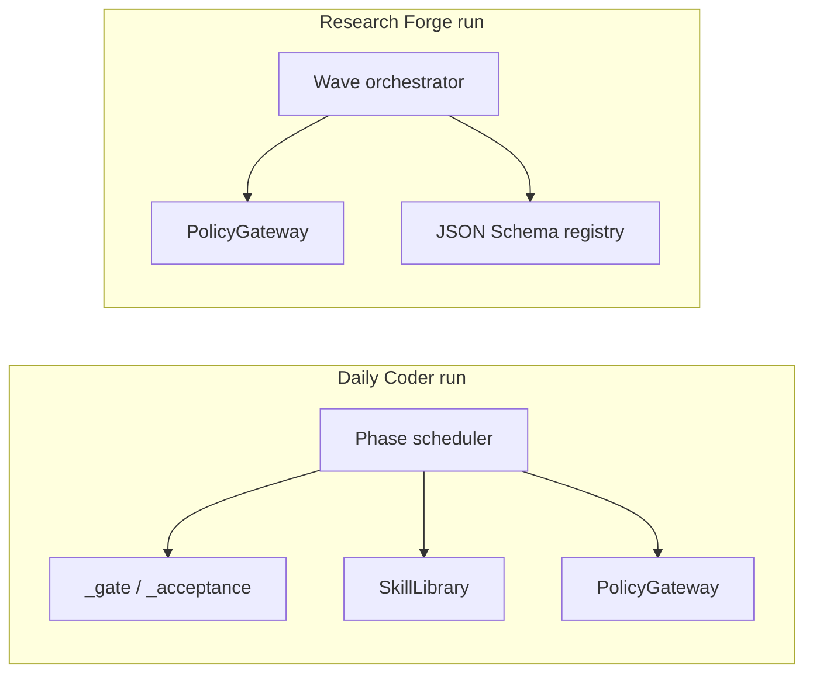

# Hooks, skills, and enforcement

This document covers **everything that intercepts or shapes agent behavior** in the `ai_agents` workspace: runtime gates in Python, the Daily Coder skills library, Research Forge policy tools, and **Cursor IDE hooks** (soft least-privilege — not PolicyGateway).

---

## Terminology

| Term in docs | Meaning in this repo |
|--------------|----------------------|
| **Hook (Cursor)** | Project lifecycle scripts under [`.cursor/hooks.json`](../../.cursor/hooks.json) — **soft** assist only |
| **Control hook (runtime)** | Deterministic checkpoint in orchestrator code before/after LLM phases |
| **Skill** | Markdown procedure file loaded into a role prompt by name |
| **Gate** | Function that returns repair, wait, or halt |

---

## Cursor / IDE hooks

**Status:** Project hooks live under [`.cursor/hooks.json`](../../.cursor/hooks.json) and [`.cursor/hooks/`](../../.cursor/hooks/). Policy data: [`agents/ide/policy/readonly-agents.json`](../../agents/ide/policy/readonly-agents.json), [`write-allowlist-agents.json`](../../agents/ide/policy/write-allowlist-agents.json) (default **empty**), [`secret-deny-globs.json`](../../agents/ide/policy/secret-deny-globs.json).

**Honesty (M22):** These hooks are **soft least-privilege**. They help block obvious mutating tools, shell, unbridged edits, and secret reads in the IDE. They are **not** Daily Coder `PolicyGateway`, Research Forge gateways, or SQLite ledger authority. Audited writes and live runs still require **`ide-bridge`** (sets `IDE_BRIDGE_ACTIVE=1` in child processes) so Python gateways enforce plan_hash and tool policy.

### Fail-closed defaults

| Situation | Behavior |
|-----------|----------|
| **Parent session** (no agent name in hook payload) | Mutations and unbridged file edits **allowed** (main Cursor chat / pack development) |
| **Platform / Task built-ins** (e.g. `generalPurpose`, `explore`, `shell`) | Same as parent — mutations allowed; not treated as ide-agents roster agents |
| Agent on **readonly** list | `subagentStart` allowed with read-only reminder; **mutations denied** unless `IDE_BRIDGE_ACTIVE=1` |
| **Unknown named** custom agent (not on readonly or write allowlist) | `subagentStart` **allowed**; **mutations and unbridged edits denied** (spoof resistance) |
| Agent on **write allowlist** (default **empty**) | Unbridged edits allowed when explicitly listed |
| Read path matching secret globs | `beforeReadFile` deny |
| Hook script error (except `stop` audit) | `failClosed: true` → block action |

Readonly roster includes the deep-research stack (orchestrator, planner, six scouts, integrator, reviewer, gap researcher, scorer), `research-messenger`, `plan-prep`, `use-master`, `master-orchestrator`, and `researcher`. Daily Coder delegate roles (e.g. `implementer`) are **not** parent/platform — they remain fail-closed for native IDE writes unless bridged.

### Hook map

| Event | Script | Behavior |
|-------|--------|----------|
| `subagentStart` | [`enforce-agent-authority.py`](../../.cursor/hooks/enforce-agent-authority.py) | Readonly ide-agents subagents **allowed** with contract reminder; platform Task types and unknown named agents **allowed** to start (writes still gated below) |
| `preToolUse` / `beforeShellExecution` | [`deny-mutating-for-readonly.py`](../../.cursor/hooks/deny-mutating-for-readonly.py) | Block mutating tools/shell for readonly **or unknown named** agents when bridge inactive; **parent** and **platform** sessions pass through |
| `beforeReadFile` | [`path-jail-audit.py`](../../.cursor/hooks/path-jail-audit.py) | Deny `.env`, credentials, keys, and related globs (Daily Coder `policies.json` spirit) |
| `afterFileEdit` | [`deny-unbridged-writes.py`](../../.cursor/hooks/deny-unbridged-writes.py) | Deny unbridged edits for readonly and unknown named agents; allow **parent**, **platform**, write allowlist, or `IDE_BRIDGE_ACTIVE=1` |
| `stop` | [`session-audit.py`](../../.cursor/hooks/session-audit.py) | Append JSONL audit records under [`agents/ide/.ide-agents/audit/`](../../agents/ide/.ide-agents/audit/) |

VS Code Copilot **Preview** agent `hooks:` (when enabled) should mirror the same intent on research `.agent.md` projections; handoffs with `send: false` remain a human gate only.

**Authoritative behavior** for Daily Coder / Research Forge runs remains **Python gateways** below — not IDE automation.

---

## Daily Coder — runtime control hooks

All paths refer to [`daily_coder/orchestrator.py`](../../agents/coding/daily-coder-ecosystem/daily_coder/orchestrator.py) unless noted.

### Phase loop envelope

```
run() → _run_locked() → for phase in workflow: _run_phase()
```

On exceptions: budget halt, `ApprovalRequired` → `WAITING_HUMAN`, `ToolDenied` → halt, generic → `_repair`.

### `_gate(run_id, phase, role, value, packet)`

**When:** After role produces schema-valid artifact.

| Role | Condition | Effect |
|------|-----------|--------|
| `planner` | `unresolved_questions` | Repair |
| `planner` | success | Sets `packet["file_allowlist"]` |
| `plan_reviewer` | verdict ≠ pass | Repair → PLAN |
| `test_executor` | verdict ≠ pass | Repair → IMPLEMENT |
| `code_reviewer` | verdict ≠ pass | Repair → IMPLEMENT |
| `alignment_checker` | verdict ≠ pass | Repair → PLAN |

### `_ready_to_build`

**When:** Phase `READY_TO_BUILD`.

**Behavior:** Computes `plan_hash`; requires approval record unless simulated auto-approve. Blocks all implementer writes until approved.

### `_acceptance`

**When:** Phase `ACCEPTANCE`.

**Behavior:** Calls [`acceptance.evaluate`](../../agents/coding/daily-coder-ecosystem/daily_coder/acceptance.py) — artifact presence, plan approval, scope allowlist, tests, reviews, alignment, revision pin.

### `_boundary_alignment`

**When:** After successful role phase (config `boundary_alignment` per profile).

**Behavior:** Optional `alignment_checker` invocations at boundaries (e.g. XL after `RESEARCH`, `PLAN`, `IMPLEMENT`) to catch drift early.

### `_repair`

**When:** Gate failure or handled exception.

**Behavior:** Increments repair counter (`max_repair_cycles` from config); routes to `failure_diagnostician` or `REPAIR_TARGET` phase map; may escalate to frontier advisor.

### `_post_run_evolution`

**When:** Entering `COMPLETE` on live runs with evolution enabled.

**Behavior:** Invokes `skill_curator` to propose candidates; `EvolutionManager.propose` — human promotion required ([`config/default.json`](../../agents/coding/daily-coder-ecosystem/config/default.json) `evolution`).

### Drift watchdog (invoke path)

During `_invoke`, config `drift_watchdog` limits identical tool calls and can re-anchor long runs (see orchestrator ~line 425).

### Policy gateway (every tool call)

[`PolicyGateway.execute`](../../agents/coding/daily-coder-ecosystem/daily_coder/policy.py):

- Authorize role + tool via broker
- Block writes without plan approval
- Record immutable tool call row in SQLite

**Composition:** `Orchestrator` → `PolicyGateway` → `ToolBroker` → filesystem/shell/web tools.

### State machine hook

[`allowed_transition`](../../agents/coding/daily-coder-ecosystem/daily_coder/state_machine.py) rejects illegal phase jumps at persistence layer (`StateStore`).

---

## Daily Coder — skills library

**Loader:** [`SkillLibrary`](../../agents/coding/daily-coder-ecosystem/daily_coder/skills.py) reads `daily-coder-ecosystem/skills/*/SKILL.md`.

**Rules:**

- Only skills named in the **approved plan** (or `default_skills`) are loaded.
- Front matter parsed; body truncated to `MAX_SKILL_CHARS` (4000).
- Missing/inactive skill → `ValueError` at load time.

### Shipped skills

| Directory | `name` (typical) | Purpose |
|-----------|------------------|---------|
| [`adaptive-routing`](../../agents/coding/daily-coder-ecosystem/skills/adaptive-routing/SKILL.md) | adaptive-routing | When to adjust workflow/profile hints |
| [`adversarial-review`](../../agents/coding/daily-coder-ecosystem/skills/adversarial-review/SKILL.md) | adversarial-review | Challenge plans/reviews before acceptance |
| [`alignment-control`](../../agents/coding/daily-coder-ecosystem/skills/alignment-control/SKILL.md) | alignment-control | Keep implementation aligned with decision |
| [`context-compaction`](../../agents/coding/daily-coder-ecosystem/skills/context-compaction/SKILL.md) | context-compaction | Summarize without losing pinned facts |
| [`documentation`](../../agents/coding/daily-coder-ecosystem/skills/documentation/SKILL.md) | documentation | Doc change discipline |
| [`exact-change-planning`](../../agents/coding/daily-coder-ecosystem/skills/exact-change-planning/SKILL.md) | exact-change-planning | Minimal diffs, explicit allowlists |
| [`frontier-escalation`](../../agents/coding/daily-coder-ecosystem/skills/frontier-escalation/SKILL.md) | frontier-escalation | When/how to request frontier tier |
| [`meaningful-testing`](../../agents/coding/daily-coder-ecosystem/skills/meaningful-testing/SKILL.md) | meaningful-testing | Tests that evidence behavior |
| [`read-only-research`](../../agents/coding/daily-coder-ecosystem/skills/read-only-research/SKILL.md) | read-only-research | Researcher lane discipline |
| [`skill-lifecycle`](../../agents/coding/daily-coder-ecosystem/skills/skill-lifecycle/SKILL.md) | skill-lifecycle | Curator proposals and promotion rules |

**Design rationale:** Skills are **optional text procedures**, not executable code — keeping policy auditable and versioned separately from the orchestrator. Only planned skills enter context (contrast with dumping entire `.cursor/skills`).

**Roles that receive skills:** `planner`, `implementer` (`_role_extra`).

---

## Research Forge — policy gateway & tools

[`PolicyGateway`](../../agents/research/research-forge/src/research_forge/policy/gateway.py) registers manifests per tool ID; Wave 1 builds gateway in [`wave1/orchestrator.py`](../../agents/research/research-forge/src/research_forge/wave1/orchestrator.py) (`build_gateway`).

Experiment tools registered in [`experiments/service.py`](../../agents/research/research-forge/src/research_forge/experiments/service.py) `_register_experiment_tools`.

**Live gate:** CLI `--live` requires decision gate validation (`validate_decisions_for_gate`).

---

## Research Forge — Wave 6 skills router

Distinct from Daily Coder markdown skills:

- [`wave6/skills/router.py`](../../agents/research/research-forge/src/research_forge/wave6/skills/router.py) — `SkillRouter` chooses manifest by request type/phase
- [`wave6/skills/builtin.py`](../../agents/research/research-forge/src/research_forge/wave6/skills/builtin.py) — built-in skill manifests
- [`wave6/skills/manifest.py`](../../agents/research/research-forge/src/research_forge/wave6/skills/manifest.py) — schema validation for skill documents

These are **routing metadata** for research phases, not Cursor Agent Skills.

---

## External Cursor skills (related, not in repo)

| Skill | Relationship |
|-------|----------------|
| **deep-research** | Methodology reference for exhaustive research; aligns with Wave 2–3 + messenger handoff |
| **research-messenger** | Read-only assembly of evidence into 17 engineering handoffs |

Use when operating Cursor agents **against** this ecosystem’s outputs — not loaded automatically by Daily Coder runtime.

---

## Composition diagram



---

## Cross-links

- [IDE Agent Pack architecture](./ide-agent-pack.md)
- [Architecture overview](../architecture/architecture-overview.md)
- [Agent thought processes](../guides/agents-thought-process.md)
- [Research Forge deep dive](../research-forge/research-forge-deep-dive.md)
- [ide-agents README](../../agents/ide/README.md)
