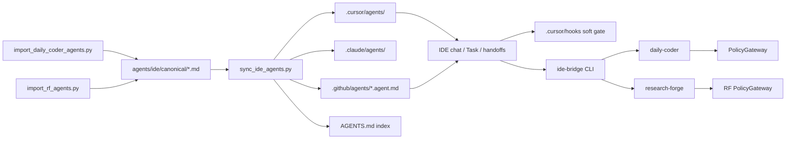

# IDE Agent Pack — architecture

The **IDE Agent Pack** ([`agents/ide/`](../../agents/ide/)) projects hub-compliant agents into Cursor, Claude Code, and VS Code Copilot from a single canonical source. It complements — does not replace — Daily Coder and Research Forge runtimes.

> **Logical vs physical:** Canonical prompts and sync banners may use the logical prefix `ide-agents/` (e.g. `#file:ide-agents/contracts/...`). In v2 that resolves to `agents/ide/` via `ai_agents_repo.resolve_ref`. Shell commands and markdown links must use the physical path `agents/ide/`.

---

## Enforcement layers (read in order)

| Layer | Authority | What it guarantees |
|-------|-----------|-------------------|
| **Hard runtime** | Daily Coder `PolicyGateway` → `ToolBroker` + SQLite; Research Forge gateways + ledger/schemas | Side effects, plan_hash, tool allowlists, acceptance |
| **Role SSOT** | [`daily-coder-ecosystem/agents/`](../../agents/coding/daily-coder-ecosystem/agents/), [`research-forge/agents/`](../../agents/research/research-forge/agents/) | Prompt text and role constraints for DC/RF |
| **Research contracts SSOT** | [`agents/ide/contracts/`](../../agents/ide/contracts/) | Deep-research rubrics, schemas, messenger rules, [`claim-enum-map.md`](../../agents/ide/contracts/claim-enum-map.md) |
| **Soft IDE layer** | Agent frontmatter deny-lists + [`.cursor/hooks/`](../../.cursor/hooks/) | Least-privilege **assist** only |

> **IDE soft controls ≠ PolicyGateway.** Hooks and readonly frontmatter can block obvious mutations in the IDE; they are not a substitute for Python gateways. Audited writes and live runs require [`ide-bridge`](../../agents/ide/bridge/README.md) (`IDE_BRIDGE_ACTIVE=1` in child processes).

See also: [Hooks, skills, and enforcement](./hooks-and-skills.md).

---

## Data flow

**Rule:** Edit [`agents/ide/canonical/`](../../agents/ide/canonical/) (or DC/RF SSOT + re-import). Never hand-edit generated paths under `.cursor/agents/`, `.claude/agents/`, or `.github/agents/`.

---

## User-facing vs delegate-only

Only **six** agents are intended for direct user invocation (pickers, slash commands, root [`AGENTS.md`](../../AGENTS.md)):

| Agent | Role |
|-------|------|
| `deep-research` | Eight-phase research orchestrator (sole lane invoker) |
| `research-messenger` | Packet assembly; 17 handoffs; no research |
| `plan-prep` | Planning context before Master (Glean when configured) |
| `use-master` | Dispatch Master DAG + bridge; **no file edits** |
| `daily-coder` | Bridge-only parent for mutating DC runs |
| `researcher` | DC researcher role — codebase recon (not open-web RF) |

All scouts, integrators, DC specialists, and RF wave roles are **delegate-only** (`user_invocable: false` in [`MANIFEST.yml`](../../agents/ide/MANIFEST.yml)).

---

## VS Code Copilot is projection-only

Files under [`.github/agents/`](../../.github/agents/) are **Copilot agent projections** (prompt + tools + handoffs). They are not the primary orchestration engine for audited coding or ledger-backed research. Per hub roadmap, treating Copilot as a replacement for Daily Coder / Research Forge is **DO NOT ADOPT**.

Handoffs with `send: false` (e.g. plan-prep → use-master → daily-coder) are a **soft human gate**. Live `READY_TO_BUILD` still requires `ide-bridge daily-coder approve` and plan_hash.

---

## ide-bridge (hard path for side effects)

Install: `pip install -e agents/ide/bridge`

| Command | Purpose |
|---------|---------|
| `ide-bridge doctor` | DC/RF CLI presence + daily-coder doctor |
| `ide-bridge daily-coder run\|approve\|resume` | Mutating DC work (mock default) |
| `ide-bridge research-forge run\|resume` | RF waves (mock default; honest wave limits) |
| `ide-bridge plan-prep scaffold` | Empty planning context template |

Exit codes follow bridge convention: `0` COMPLETE (live acceptance), `1` SIMULATED/mock-success, `2` PARTIAL, `3` BLOCKED, `4` policy denied.

The `daily-coder` IDE agent must **not** emulate the SQLite phase DAG in chat — only dispatch bridge commands.

---

## Cursor hooks (soft)

Policy rosters: [`readonly-agents.json`](../../agents/ide/policy/readonly-agents.json), [`write-allowlist-agents.json`](../../agents/ide/policy/write-allowlist-agents.json) (default empty), [`secret-deny-globs.json`](../../agents/ide/policy/secret-deny-globs.json).

**Fail-closed for ide-agents roles:** readonly roster agents and **unknown named** custom agents are denied mutations and unbridged file edits unless `IDE_BRIDGE_ACTIVE=1`. **Parent** (unnamed session) and **platform** Task subagents may edit for pack development; audited Daily Coder / live RF work still requires `ide-bridge`. See hook map in [hooks-and-skills.md](./hooks-and-skills.md).

Unit tests: [`agents/ide/tests/test_cursor_hooks.py`](../../agents/ide/tests/test_cursor_hooks.py).

---

## Deep-research evaluation smoke

Golden and adversarial cases live in [`agents/ide/contracts/evaluation-suite.md`](../../agents/ide/contracts/evaluation-suite.md) (mirrors the deep-research skill suite).

| Cases | IDE smoke status | Notes |
|-------|------------------|-------|
| 1–8, 13–15 | **PASS** (manual / fixture-driven) | Schema validators, messenger rules, claim enums via contracts + bridge where implemented |
| 9–10 | **PARTIAL** | Scoring arithmetic checks depend on live scorer output or dedicated validator CLI |
| 11–12 | **PARTIAL** | Correction loops and true concurrent lane traces need live LLM + Task fan-out |
| Live LLM lanes | **PARTIAL** | IDE cannot guarantee parallel execution on every host; use “logically independent” wording only with trace proof |

Do not claim prompt-only recon matches measured Research Forge Wave 2–3 token savings (**master A19**): IDE `researcher` is an operator approximation, not a trained explorer benchmark.

---

## CI

Monorepo CI runs:

- `python agents/ide/scripts/sync_ide_agents.py --check`
- `python agents/ide/scripts/import_daily_coder_agents.py --check`
- `python agents/ide/scripts/import_rf_agents.py --check`
- `python -m unittest discover -s agents/ide/tests -v`

---

## Related docs

- Operator quick start: [`agents/ide/README.md`](../../agents/ide/README.md)
- Master spec (M1–M22): [`agent_orchestration_master_spec.md`](../architecture/agent_orchestration_master_spec.md)
- GUI: IDE pack is complementary; live run UI remains in [`gui/`](../../gui/)
