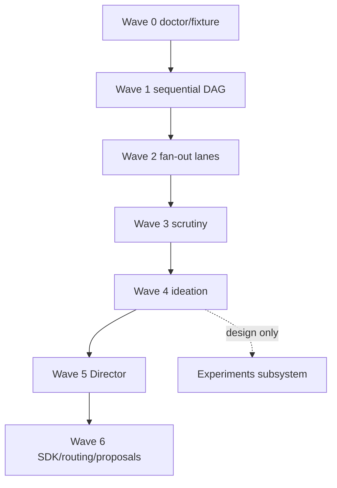

# Research Forge — deep dive

Research Forge is an **evidence-first** research system shipped as the Python package `research_forge` ([`agents/research/research-forge/`](../../agents/research/research-forge/)). Default mode is **mock-by-default**: adapters return fixtures unless `--live` passes decision gates.

Version note: package metadata references `0.7.0+experiments` with a local experiment subsystem ([`docs/IMPLEMENTATION_STATUS.md`](../../agents/research/research-forge/docs/IMPLEMENTATION_STATUS.md)).

---

## Table of contents

1. [Design goals](#design-goals)
2. [Authority and artifacts](#authority-and-artifacts)
3. [Wave map](#wave-map)
4. [Wave 1 — sequential DAG](#wave-1--sequential-dag)
5. [Wave 2 — lanes and fan-out](#wave-2--lanes-and-fan-out)
6. [Wave 3 — scrutiny and adversarial review](#wave-3--scrutiny-and-adversarial-review)
7. [Wave 4 — ideation and lineage](#wave-4--ideation-and-lineage)
8. [Wave 5 — Director and handoffs](#wave-5--director-and-handoffs)
9. [Wave 6 — adapters, routing, proposals](#wave-6--adapters-routing-proposals)
10. [Evidence rubric and claim status](#evidence-rubric-and-claim-status)
11. [Scoring and curation](#scoring-and-curation)
12. [Deep-research skill alignment](#deep-research-skill-alignment)
13. [Research Messenger handoff](#research-messenger-handoff)
14. [Local experiments](#local-experiments)
15. [CLI, gates, and limitations](#cli-gates-and-limitations)

---

## Design goals

| Goal | Implementation |
|------|----------------|
| No silent live I/O | `PolicyGateway` mode mock/live; CLI validates gates |
| Structured outputs | JSON Schema in [`schemas/`](../../agents/research/research-forge/schemas/) |
| Audit trail | `JsonlLedger` ([`ledger/jsonl.py`](../../agents/research/research-forge/src/research_forge/ledger/jsonl.py)) |
| Cost awareness | `BudgetManager` + config [`budgets.yaml`](../../agents/research/research-forge/config/budgets.yaml) |
| Human promotion | Experiments, live adapters, proposal merges |

---

## Authority and artifacts

| Artifact type | Schema file | Typical producer |
|---------------|-------------|------------------|
| Research request | `research_request.schema.json` | User / CLI |
| Charter / plan | `charter.schema.json`, `research_plan.schema.json` | Wave 1 |
| Source | `source_record.schema.json` | Search/read adapters |
| Evidence | `evidence_card.schema.json` | Extractor |
| Matrix | `evidence_matrix.schema.json` | Wave 3 mapper |
| Claim status | `claim_status.schema.json` | Integrators / reviewers |
| Idea | `idea.schema.json` | Wave 4 ideator |
| Director packet | `director_packet.schema.json` | Wave 5 builder |
| Experiment | `experiment.schema.json` | Experiment creator |

Validation: [`schemas_pkg/registry.py`](../../agents/research/research-forge/src/research_forge/schemas_pkg/registry.py).

Workspace layout for runs/experiments: see [`settings.find_workspace_root`](../../agents/research/research-forge/src/research_forge/settings.py) — prefer `RF_WORKSPACE`.

---

## Wave map

Waves are **composable modules**; not every CLI entry runs the full stack. See [`cli.py`](../../agents/research/research-forge/src/research_forge/cli.py) commands.

---

## Wave 1 — sequential DAG

**Orchestrator:** `Wave1Orchestrator` — [`wave1/orchestrator.py`](../../agents/research/research-forge/src/research_forge/wave1/orchestrator.py)

**Phases (`PHASES`):**

`clarify → charter → search → select → read → extract → verify → compose → done`

| Phase | Class | Responsibility |
|-------|-------|----------------|
| clarify | `IntakeClarifier` | Normalize request; surface ambiguities |
| charter | `CharterPlanner` | Research questions, depth, stop rules |
| search/select/read | adapters + helpers | `gated_search`, `gated_read` |
| extract | `EvidenceExtractor` | Evidence cards from reads |
| verify | `CitationVerifier` | Citation/link consistency |
| compose | `ReportComposer` | Final structured report |

**Live contract:** [`live_gate.py`](../../agents/research/research-forge/src/research_forge/wave1/live_gate.py) builds/validates live mode requirements.

**Run state:** `RunState` dataclass persists phase-local fields for resume; CLI [`resume`](../../agents/research/research-forge/src/research_forge/cli.py) reloads disk state and continues the Wave 1 orchestrator (see [`tests/test_cli.py`](../../agents/research/research-forge/tests/test_cli.py)).

---

## Wave 2 — lanes and fan-out

**Orchestrator:** `FanOutOrchestrator` — [`wave2/fanout.py`](../../agents/research/research-forge/src/research_forge/wave2/fanout.py)

**Trigger:** `should_fan_out(charter)` — minimum depth and question count from [`config/wave2.yaml`](../../agents/research/research-forge/config/wave2.yaml).

**Pipeline:**

1. `LandscapeMapper.map_landscape` → lanes with angles, source classes, stop rules
2. `FanOutScheduler` + `SourceScout` (mock search adapter by default)
3. `SourceCurator` — weighted ranking
4. `SaturationEngine` / `ExpansionCoordinator` — stop when duplicates dominate

**Lane type:** `ResearchLane` in [`wave2/types.py`](../../agents/research/research-forge/src/research_forge/wave2/types.py).

**Analogy (not a code citation):** Independent parallel lanes resemble **multi-agent debate / multi-query RAG** where agents do not see each other's drafts until integration — similar to deep-research skill §2 “six independent lanes.”

---

## Wave 3 — scrutiny and adversarial review

**Orchestrator:** `ScrutinyOrchestrator` — [`wave3/orchestrator.py`](../../agents/research/research-forge/src/research_forge/wave3/orchestrator.py)

| Stage | Module | Behavior |
|-------|--------|----------|
| Methods | `MethodsReviewer` | Per-source methods flags |
| Contradictions | `ContradictionMapper` | Matrix + conflict records + gaps |
| Skeptic | `AdversarialSkeptic` | Objection rounds; **search forbidden** (`assert_no_search`) |
| Falsification | `FalsificationDesigner` | Actionable disconfirming tests |
| Follow-up | `FollowUpCoordinator` | Optional extra scout lane |
| Audit | `ResearchAuditor` | Sampled audit; `acceptance_blocked` |

**Skeptic output:** verdicts like `contained`, `challenge_open`, `round_cap_reached` ([`wave3/skeptic.py`](../../agents/research/research-forge/src/research_forge/wave3/skeptic.py)).

**Explicit design link:** Adversarial skeptic with frozen charter mirrors **constitutional / critique-style** review loops — implemented as deterministic policy errors, not a second search agent.

**Config:** [`config/wave3.yaml`](../../agents/research/research-forge/config/wave3.yaml) — `max_rounds`, auditor sample rate.

---

## Wave 4 — ideation and lineage

**Orchestrator:** `IdeationOrchestrator` — [`wave4/orchestrator.py`](../../agents/research/research-forge/src/research_forge/wave4/orchestrator.py)

Flow:

1. Optional scrutiny gate (`_gate_scrutiny`) — blocks if audit blocked unless `human_override`
2. `IndependentIdeator.run` × N (`parallel_ideators` config)
3. `FabricationChecker.audit_idea` — can block promotion
4. `PortfolioDimensions.score_batch`
5. `PromotionRules.try_promote` with evidence index
6. `LineageGraph` records ancestry ([`wave4/lineage.py`](../../agents/research/research-forge/src/research_forge/wave4/lineage.py))
7. `ExperimentArchitect` — **design-only** experiment plans (not executed)

**Analogy:** Multiple ideators + fusion ≈ **multi-agent brainstorming with merge step**; fabrication checker ≈ **claim–evidence alignment** before ideas enter registry.

---

## Wave 5 — Director and handoffs

**Orchestrator:** `DirectorOrchestrator` — [`wave5/orchestrator.py`](../../agents/research/research-forge/src/research_forge/wave5/orchestrator.py)

| Component | File | Role |
|-----------|------|------|
| Packet builder | `packet_builder.py` | Token ceiling packing + selection log |
| Fidelity | `fidelity.py` | Ensures packet faithful to source |
| Eligibility | `eligibility.py` | Whether Director may run |
| Director role | `director_role.py` | `PrincipalResearchDirector` policy |
| Provider | `provider.py` | Mock fixtures or live calls |
| Validator | `validation.py` | Output schema compliance |
| Challenge | `challenge.py` | High-stakes challenge path |
| Approval tokens | `approval.py` | Human/token store for sensitive actions |

**Handoff taxonomy:** [`wave5/handoff.py`](../../agents/research/research-forge/src/research_forge/wave5/handoff.py) compares conditions:

- `raw_trajectory`
- `director_packet`
- `minimal_brief`

Used for **evaluation** of synthesis quality metrics (`HandoffOutcome`), informing which stratum to pass to downstream humans/agents.

**Config:** [`config/wave5.yaml`](../../agents/research/research-forge/config/wave5.yaml)

---

## Wave 6 — adapters, routing, proposals

Package [`wave6/`](../../agents/research/research-forge/src/research_forge/wave6/):

| Area | Purpose |
|------|---------|
| `adapters/` | Scholarly, code repo, patent, standards, internal knowledge (mock implementations) |
| `sdk/` | Adapter protocol, conformance, registry |
| `routing/` | Shadow/offline routers, promotion, guardrails |
| `proposals/` | Improvement proposal workflow, canary, replay |
| `maintain/` | Drift, deprecation, disaster recovery, adversarial fixtures |
| `skills/` | Manifest-based skill routing (Forge-native) |

Config: [`config/wave6.yaml`](../../agents/research/research-forge/config/wave6.yaml), plugins [`wave6_plugins.yaml`](../../agents/research/research-forge/config/wave6_plugins.yaml).

---

## Evidence rubric and claim status

**Schema enum** ([`claim_status.schema.json`](../../agents/research/research-forge/schemas/claim_status.schema.json)):

`VERIFIED`, `CORROBORATED`, `INFERENCE`, `ASSUMPTION`, `CONTESTED`, `UNKNOWN`, `REJECTED`

Daily Coder roles use a **related but separate** tagging vocabulary in prompts (VERIFIED, INFERENCE, ASSUMPTION, HYPOTHESIS, UNKNOWN).

**Deep-research skill rubric** (external, richer):

- Claim grades: `CONFIRMED`, `CORROBORATED`, `SUPPORTED`, `INFERRED`, `CONFLICTING`, …
- File: `~/.cursor/skills/deep-research/references/evidence-and-source-rubric.md`

When operating Cursor deep-research **on** Forge outputs, map statuses explicitly — do not assume enum parity.

---

## Scoring and curation

Curator weights in [`config/scoring.yaml`](../../agents/research/research-forge/config/scoring.yaml):

| Dimension | Weight |
|-----------|--------|
| relevance | 0.20 |
| authority | 0.15 |
| independence | 0.15 |
| uniqueness | 0.10 |
| access | 0.10 |
| recency | 0.10 |
| contradiction_value | 0.10 |
| expected_information_gain | 0.10 |

Routing score thresholds: `fan_out_coverage_delta_min`, `fan_out_cost_regression_max`.

**Recommendation scoring** for messenger/deep-research lives in external skill `recommendation-scoring.md` — Forge code uses curator/routing YAML unless a human applies messenger assembly.

---

## Deep-research skill alignment

The Cursor **deep-research** skill describes an orchestration pattern that this codebase implements **partially in Python** and **partially as operator procedure**:

| Skill stage | Forge / ecosystem counterpart |
|-------------|------------------------------|
| Research Planner | Wave 1 clarifier + charter |
| Six scout lanes | Wave 2 `FanOutOrchestrator` |
| Targeted gap researcher | Wave 3 `FollowUpCoordinator` |
| Evidence integrator | Evidence matrix + composer (Wave 1/3) |
| Adversarial reviewer | `AdversarialSkeptic` + auditor |
| Recommendation scorer | External skill + Wave 5 evaluation metrics |
| Messenger | External skill; 17 handoffs ≈ Daily Coder role set |

**Non-negotiable skill rule:** read-only — matches Forge mock/live gates (no tool write without manifest).

---

## Research Messenger handoff

**Skill location:** `~/.cursor/skills/research-messenger/SKILL.md`

**Modes:** `ASSEMBLE`, `ECOSYSTEM`, `COMBINED` (default from deep-research).

**Output contract:** `research-intelligence-packet-1.0.schema.json` (skill references).

**Relationship to this repo:**

- Messenger **does not** invoke Research Forge CLI automatically.
- It organizes an existing corpus into ledgers + **exactly 17** engineering role handoffs (proposals only).
- Daily Coder’s 16+ roles are the **execution** counterparts; Messenger is **planning intelligence export**.

Wave 5 `HandoffTaxonomy` measures packet quality strata — complementary to Messenger’s human/report split.

---

## Local experiments

Separate from Wave 4 design architect:

| Stage | Code | Token use |
|-------|------|-----------|
| Create | `ExperimentCreator` | 0 |
| Pre-review | `ExperimentPreReviewer` | 0 (deterministic) |
| Run | `ExperimentRunner` | 0 |
| Post-review | `ExperimentPostReviewer` | May use model per config |

Kinds: `dataset_profile`, `group_comparison`, `python_unittest_benchmark` ([`experiments/kinds.py`](../../agents/research/research-forge/src/research_forge/experiments/kinds.py)).

Results labeled **`LOCAL_OBSERVATION`** until promoted — see EXPERIMENTS.md.

---

## CLI, gates, and limitations

| Command | Behavior |
|---------|----------|
| `doctor` | Wave 0 health |
| `validate --gate` | Decision file checks |
| `run --wave1 --request` | Wave 1 orchestrator |
| `run --dry-run` | Plan only |
| `experiment *` | Experiment pipeline |
| `resume` | Resume paused Wave 1 run from persisted state (`--answer` for clarifications; `--live` gated) |
| `status` | Inspect persisted Wave 1 run metadata and phase |

**Before live research:** IMPLEMENTATION_STATUS checklist (security, adapters, decisions).

**Known limits:**

- Mock sources must not be presented as real research.
- Experiment runner is not a security sandbox.
- Many wave paths expect checkout via `find_repo_root()`.

---

## Cross-links

- [Design lineage](./design-lineage.md)
- [Agent thought processes](./agents-thought-process.md)
- [Hooks, skills, and enforcement](../ide-agents/hooks-and-skills.md)
- [Build roadmap narrative](../architecture/build-roadmap.md)
