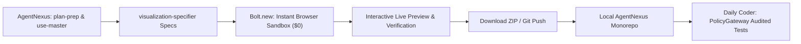

# StackBlitz Bolt.new: AgentNexus Integration Guide

This guide details how to use **StackBlitz Bolt.new** as an agile full-stack prototyping worker within **AgentNexus**.

---

## 1. Bolt.new's Role in AgentNexus: Rapid Sandboxed Prototyping

Bolt.new is an in-browser, full-stack AI coding workspace powered by WebContainers. It runs Node.js, Vite, Next.js, and databases entirely in your browser without local setup.

In AgentNexus, Bolt.new is assigned to the **Rapid UI & Full-Stack Prototyping Phase**:
- Instantly building dashboards, web UIs, and interactive widgets specified by `visualization-specifier`.
- Prototyping full-stack REST API mocks and client applications before committing code to the local monorepo.
- Testing user workflows in an isolated, disposable browser sandbox.

---

## 2. Maximizing Bolt's Free Tier

Bolt.new provides free daily tokens upon creating a StackBlitz account:
1. **One-Shot Scaffolding**: Instead of typing 10 conversational messages (which drains daily tokens), provide a comprehensive, structured system prompt (from [`bolt_prompt_templates.md`](./bolt_prompt_templates.md)) in your very first message.
2. **Deterministic Tech Stacks**: Explicitly specify Vite + React + Tailwind or Next.js App Router to avoid Bolt spending tokens guessing package configurations.
3. **Local Export**: Once Bolt renders the working application in its live preview pane, download the project ZIP or push it directly to GitHub, then pull it into AgentNexus.

---

## 3. The Bolt $\rightarrow$ Nexus Bridge Workflow

See [`bolt_to_nexus_sync.md`](./bolt_to_nexus_sync.md) for step-by-step instructions on pulling Bolt projects into the monorepo.
